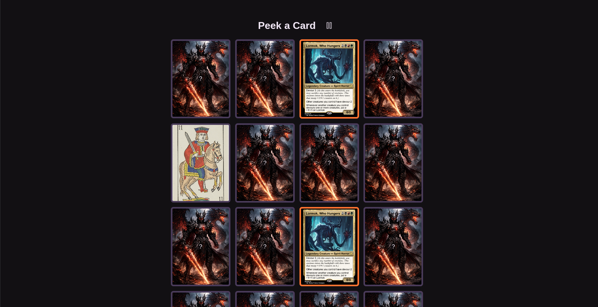

# Peek - Vue 3 Card Game

A memory card matching game built with Vue 3, TypeScript, and Vite. This application demonstrates modern Vue 3 development practices using `<script setup>` Single File Components and Composables for state management, while featuring a highly customizable and aesthetically pleasing interface.

## About the Game

Peek is an interactive memory card matching game where the objective is to find all matching pairs of cards on the board as quickly and efficiently as possible. Relying on short-term memory, players must memorize card locations to win before penalties stop them!

### New Enhancements

- 🎃 **Halloween Dark Mode**: A unified dark theme across the application using vibrant pumpkins, purples, and deep dark backgrounds for an immersive experience.
- 🌎 **Bilingual Support (English & Spanish)**: Integrated simple internal i18n support. Change languages at any time directly from the settings menu using a customized drop-down without losing your game progression.

### Core Features

- **Responsive Gameplay:** A 4x4 grid of cards randomized each round.
- **Customizable Settings:**
  - **Time Limit:** Players have a customizable amount of time to find all the matches. A warning pulses when time is running low! By default, you have 60 seconds.
  - **Attempt Limit:** Players have a set maximum number of unsuccessful matches before it's game over.
  - **Settings Modal:** Click the gear icon during the game to configure custom time limits and attempts, toggle them on/off, and change the game's language.
- **Dynamic Feedback:** Real-time remaining time and attempts are always visible alongside the matches you've secured. If time or attempts run critically low, the game will alert you with visual effects.
- **End of Game Overlay:** Clean UI alerts for "🎉 You Win!", "⏳ Time's Up!", or "❌ Out of Attempts!" preventing further interaction until the game resets.

## How to Play (In-Depth Rules)

1. **Start:** The game begins with 16 cards face down, forming 8 hidden pairs.
2. **Reveal:** Click any card to reveal its image. Memorize this image and its position.
3. **Match:** Click a second card to see if it matches the first card.
   - _If they match_: The cards stay face-up and are highlighted with the Halloween panel color. Your "Matches" score goes up.
   - _If they don't match_: They will briefly stay visible (giving you a chance to memorize them) and then flip back over. Your "Attempts" counter will decrease by one.
4. **Win Condition:** Uncover all 8 pairs before your time or attempts theoretically run out.
5. **Loss Condition:** If enabled, reaching 0 seconds on the clock, or making too many wrong guesses (Attempts = 0) will end the game instantly in a loss.
6. **Controls:**
   - To pause and change the difficulty/language, click the **Settings button** (gear icon) at the top of the page. Changing settings will reboot the game.
   - Click the **shape-shifting button** at the bottom at any time to explicitly restart the game and shuffle the deck without changing your settings.

---

_Learn more about the recommended Project Setup and IDE Support in the [Vue Docs TypeScript Guide](https://vuejs.org/guide/typescript/overview.html#project-setup)._
